**Spring Security Intro**
```
It is about application level security

(a)Authentication

(b)Authorization

security is large. it can start from the network to the infastructure layer.

It is the logic we write in our application that is related to security.

Authentication-->Logic in my application that decides who is the user trying 
to do something.

Can be achieved By: [ UserName & Password, Hashed Fingerprint, or Some Complex 
Certificate]

Authentication is where the application tries to establish who you are.
Authorization...the application decides if you are allowed or not allowed to do something.

we configure the authorization rules.
In a web application i protect access to  my resources based on the
authorization rules.

We have specific authorities or roles.
Authority---? is something you have. An action i can do.
Role--------? is something you are.It is a Badge. Admin, Manager, Etc

They have the same interface behinds the scenes, (Both Authentication and Authorization)
GrantedAuthority.

Spring security provides varoius authentcation mechanisims

(a)Http Basic
(b)Cert
(c)Jwt/Oauth2 flows

```

| Authentication | Authorization Rules     |
|----------------|-------------------------|
| Http Basic     | WEB Apps  (Http Filters) | 
| Certificate    | Non Web Apps (Aspects)  | 
| JWT/Oauth2.0   |                         | 

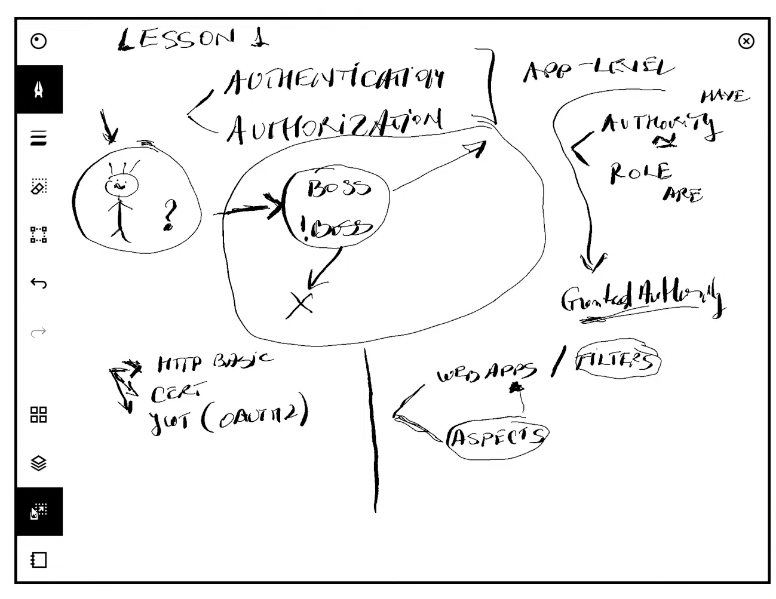

**Spring Security Config**

```
By default all resources in my application when i have spring security are secured.
With the randomly generated credentials.

They are secured by Http Basic Authentication.

```
**Encoding, Encryption and Hash Functions**


| Encoding                                                                                 | Encryption                                                                              | Hash functions                                                                                                                             |
|------------------------------------------------------------------------------------------|-----------------------------------------------------------------------------------------|--------------------------------------------------------------------------------------------------------------------------------------------|
| It is function that is always pssible to <br/>revert somehow.                            | You are transforming an input into an output<br/>                                       | From and input you can get the output.<br> but from the output you cannever by any means find the input.                                   |
| it may be a mathematical computation that does not <br/> need even a secret to decode it | But to go back to the input you always need a secret.                                   | 2nd rule of a hash function is <br/> if you have an input for a hash function you can be able to test if it corresponds to the output<br/> |
| example 345 --> reversing it to 541 is an encoding<br/>                                  | Not everyone is able to find waht was the input after an<br/> encryption functioin<br/> | wow, this is how padsswords work, I.e you can do an equality check, but you can never revert back.                                         |
 | In an encoding, you can always revert the output to find the input if you know the rule  | It is still a trandfomation but it implies you need a secret to go back to the input.   | if one stoled hashed password, they cannever find the input.                                                                               |
 | In an Ecoding you do not even need to have a secret.                                     | Without a secret you cannot go back.                                                    |                                                                                                                                            |
 | Can be always reversed                                                                   | A secret is also known as a key and it can be symetric or assymeric,                   |                                                                                                                                            |
      
  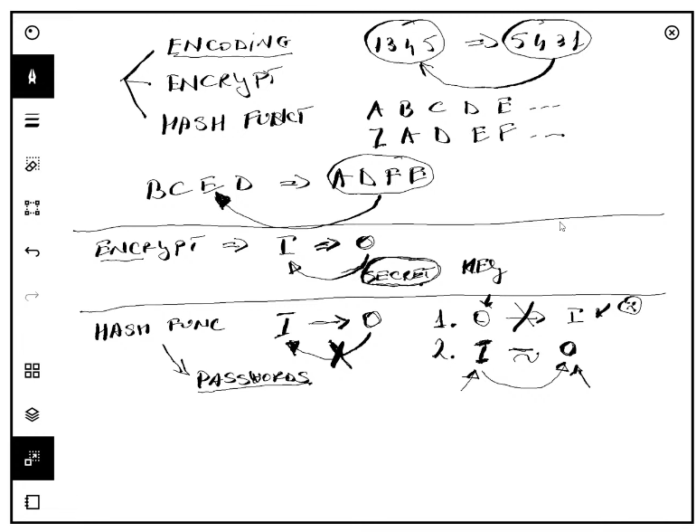


**Creating UserDetails Service**

```
it is that compoment that manages my details.
it tells spring security where to get credentials from.
Meaning i can have my custom HttpBasic password.
if i have users, i can store their passwords.

```

**Spring Security Architecture (Behind the SCENES)**
**The Authentication Filter**


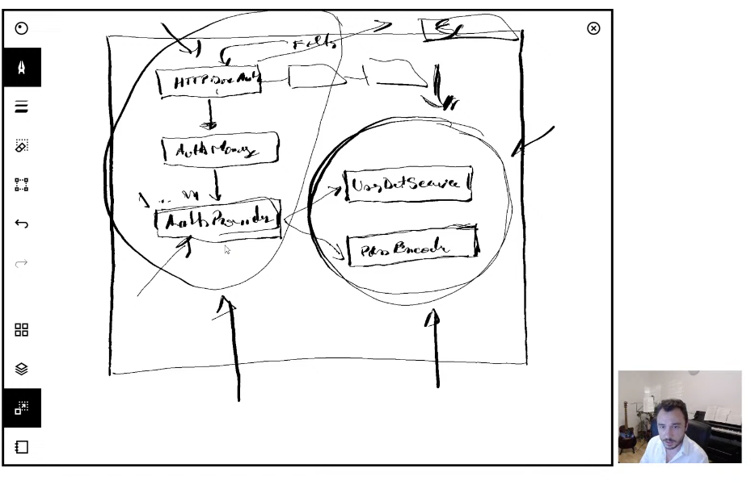

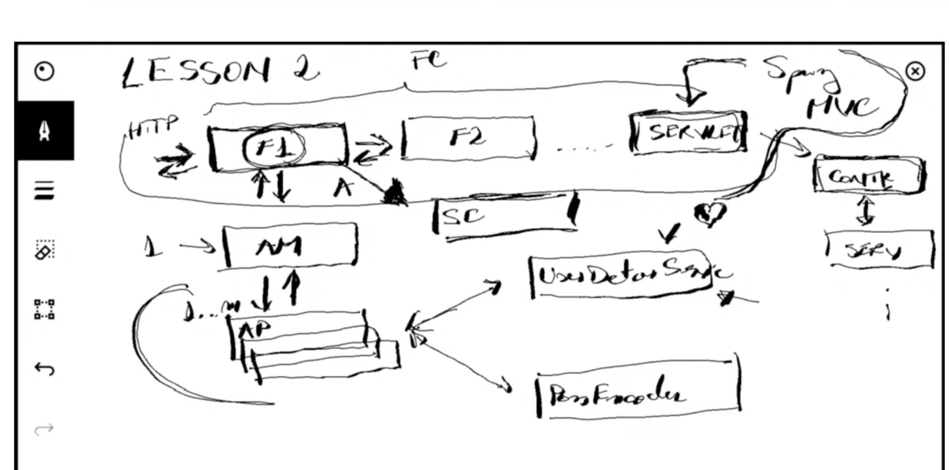

```
Spring Security especially in WebApps is a sequence of filters.
Http Request get through to the application after a number of filters.
When a HTTP request comes, before it goes to the controller, we start with the  {Authentication Filter} first of all

(a)Authentication Filter---> Authentication Manager
(b) Authentication Manager------->Authentication Provider
(c)Authentication Provider-------> UserDetails Service
(d)User details service, if password is hashed calls---> Password Encoder
(e)Once the Match is successful, we put the UserDetails in the security context.
   (With the Role and Permission..
(f)After this we can go to the authorization Filter.

Contract between Spring security and your application  bu which your app knows how
to obtain user details.

UserDetails is an interface, all we need is to implement it and spring secuerity
will know where to get user credentials...

including the DataBase or even a web service

(g)After a successful authentication, the User Object is stored in the context.
  Authentication is stored in the security context.
  
 public String demo(){
        var u = SecurityContextHolder.getContext().getAuthentication();
        u.getAuthorities().forEach(System.out::println);
        return "Demo";
 }
 
```

**Adding User Details to context**

```
Method One (Configuration Way.........
@Configuration
public class SecurityConfig {

    @Bean
    public UserDetailsService userDetailsService(){
        return new JPAUserDetailsService();
    }
}

Method Two (StereoType Way............

@AllArgsConstructor
@Service
public class JPAUserDetailsService implements UserDetailsService {
    private final UserRepository userRepository;

    //Spring security will get my User from this method
    //And return a userDetails Object and place it into the context.
    //from the below implementation i have provided my User to Spring Security.
    @Override
    public UserDetails loadUserByUsername(String username){
        var user = userRepository.findUserByUserName(username);
        return user.map(SecurityUser::new).orElseThrow(()->new UsernameNotFoundException("username not found" + username));
    }

}

N/B
My Default Implementation of Authentication in Spring Security is HttpBasic.
UserName & Password

```

**(Granted Authority Interface) -->Implementation Roles and Authrorities**

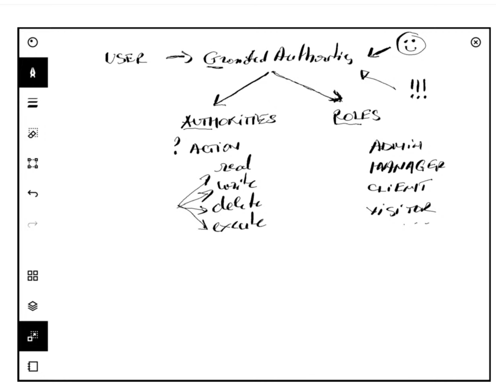

```
@AllArgsConstructor
public class SecurityUser implements UserDetails {

    private final User user;

    @Override
    public String getUsername() {
        return user.getUsername();
    }

    @Override
    public @Nullable String getPassword() {
        return user.getPassword();
    }

    @Override
    public Collection<? extends GrantedAuthority> getAuthorities() {

        return List.of(() -> "read");
    }

}

A spring security User has what we call granted authority, which is the interface beneath
which roles and authorities are implemented.

An authority is an action which a user can do. (read, write, delete)
A role is a Badge represented by a subject, admin, manager,client,visitor
It depends on how you want to implement  authorities in your app.
If you want granular actions, Authortities
I may also want to badge my users, eg Admin, and all the actions they can do.
(Role-->Groups Actions)

```

**Project three**

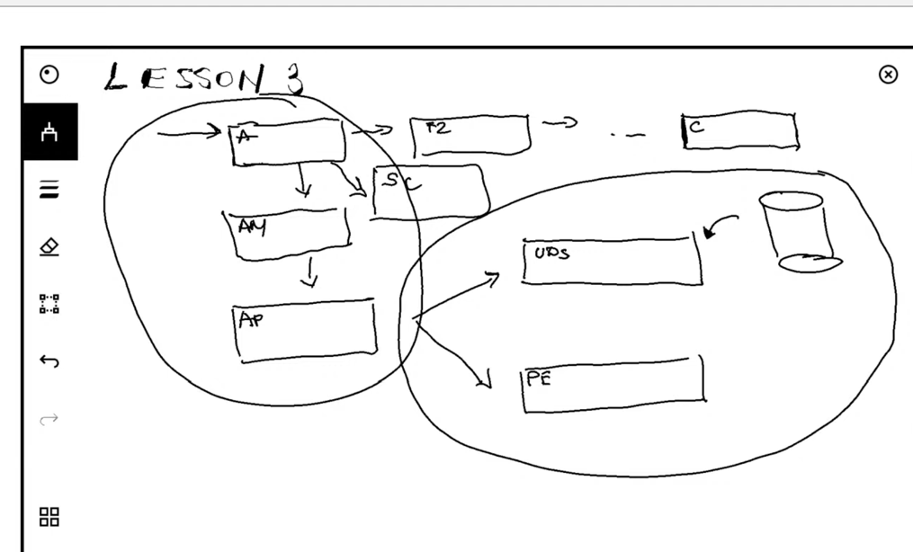

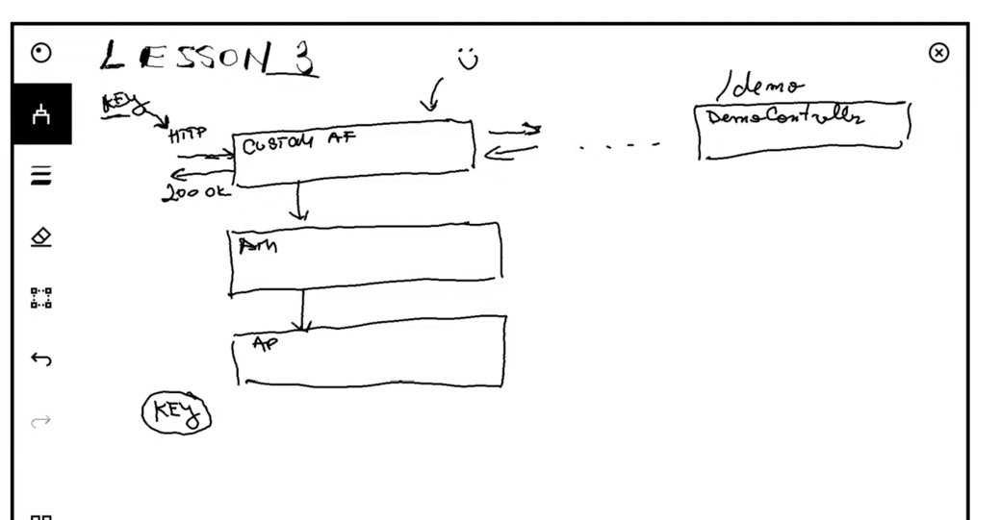


**Task (Implementing our own custom Authentication**

```
The above is a custom authentication architecuture that uses my custom key to authenticate.

.ie.Not UserName and Password.

Rather than the username and password, we can also be able to implement our custom authentication.
(Convention ones include: Http Basic, OpenId connect, OAUTH2.O, cerificate authentication syle.

```
**SecurityFilterChain Bean**

```


When writing my custom spring security configuration, i must overrie this bean

  @Bean
    public SecurityFilterChain securityFilterChain(HttpSecurity http){
       return http
               .addFilterAt(customAuthenticationFilter, UsernamePasswordAuthenticationFilter.class)
               .authorizeHttpRequests((authorize) -> authorize.anyRequest().authenticated())
               .build();

    }
    
//if i override the securuty filter chain Bean, then i mist write my default security configuration
    //One this is realise tis the filter that spring boot configures for us by default.(UsernamePasswordAuthenticationFilter)
    //if i want to configure my authentication i use the security filter chain bean.
    //By default the Security filter chain uses the UserName and Password authentication filter.
    //I am overriding the default implementation of the security filter chain
    //i am adding a new filter at the position where the UserNamePasswordFilter would have stayed
    //i am adding a custom authentication filter at the position of the other filter.
```

**Authorization Filter**

```
Takes in the authentication from the security context and applies the rules.

```


**Project Four(Multiple Authentication)**

```
(Old spring security design where you could have had Just one authentication manager,
and multiple providers)

(this can still work but only with two default filters)
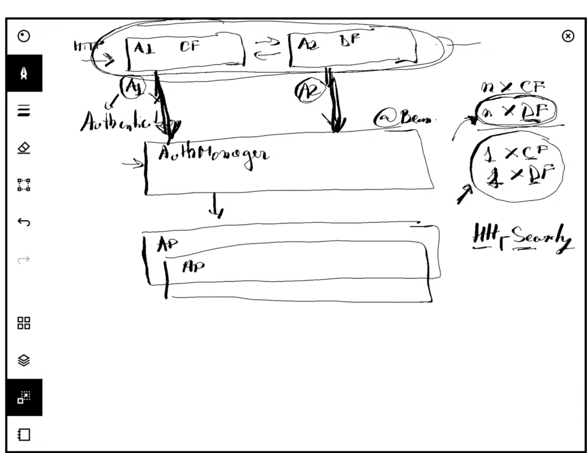

When implementing multiple authentication, i need two different authentication filters.

```

**Custom Filter + Default Filter Architecture**

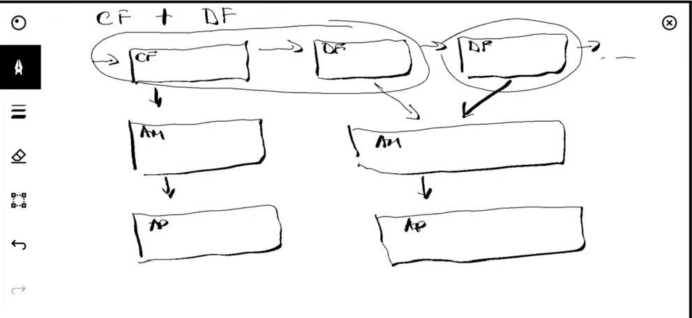


**Http Security Object**

```
HttpSecurity Object is the one that defines the entire security configs
for Our Application.    
When our applications are starting, they normally use this configuration

The below creates an entire Http Basic configuration.
(a)When HttpBasic is called, it creates a configurer.
(b)When the application starts, it creates the Filter, Auth manager, provider, etc..
(c)Anything we add here helps configure something in the entire architecture of Spring Security.
   

When i have multiple authentications and therefore multiple filters, what spring security needs me to do
is to return an authentication,

Either of my Filters should return an Authentication Object.


```

**Lesson 5**

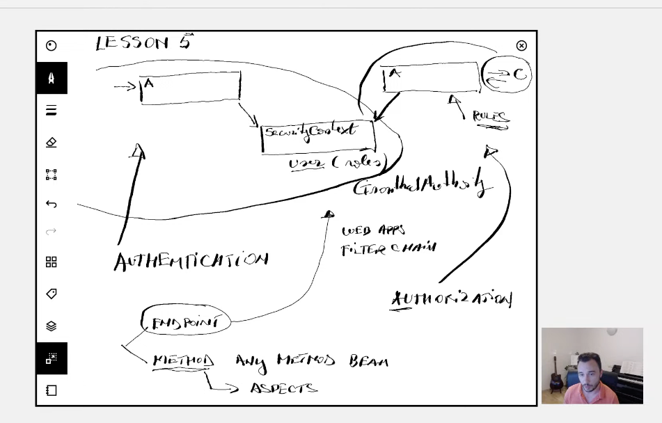


**Authorization**
```
Key Concept----->Every Form of Authentication has a filter.

Inside the AuthX Filter,(we have the manager, provider, user details service etc

At the end if the authentication is successful, we normally have an Authentication Object
stored in the security context.(it is a standard security Object)

The authentication object has got everything about the user who authenticated,
i.e Roles & Permissions as well.

The Authorization filter now uses this information to give or deny  access to our 
application resources.

Authorization is always after authentication because it depends 
on the Authentication Object.

Authorization can be implemented in 2 different ways in spring security.

(a)Endpoint Level.

(Only for WebApps) 
(Applied in Filter Chain before the controller)

(b)Method Level.

You can apply it on any bean method.
The method is aspected via spring security rules.

401-->Authentication fails
403-->Forbidden, Authorization fails.

   //endpoint level authorization
        /*used for web applications
         (a).anyRequest().authenticated(), for this one all the resources will be accessed as long as the user is authenticated.
            matcher method + authorization rule
            
           
          //1.Which matcher method i should use and how? (anyRequest(), mvcMatchers(),antMatchers(), regexMatchers()
            2.How to apply different authorization rules.

          The only way you will get rejected is if you did not authenticate at all.

         (b)authorize.anyRequest().permitAll() // rule 2 (permits all, but when you decide to add a password that is wrong, it will not authenticate
           when you try to use a wrong password, the authentication filter will fail, wow.
           wrong auth will still reject,
           authorization is always after authorization

          (c)authorize.anyRequest().hasAuthority("read")
            Only when you have the authority read, you can access any endpoint.

          (d)  authorize.anyRequest().hasAnyAuthority("read","write") enumerates authorities

        Roles relate to a group of actions or permissions

          (e) configurations with the Spring Expression Language.
           authorize.anyRequest().access(new WebExpressionAuthorizationManager("isAuthenticated() and hasAuthority('read')") ))//SPEL----->authorization rules )

```
**Tips**
```
1.SpringBoot---->Convention over configuration apporoach
Spring Boot based on dependencies we add configures our applications somehow.

spring-web (will confugure a tomcat container, dispatcherservelet, view)
security

2.Spring Security, (Spring Boots)

3.Spring Security Starts with a Filter Just before your request.

when using a web app

security filter---->endpoint

4.Wow spring boot provides a default username and password authentication filter,that
we configure with a UserDetail service.

```

**Thread Local Concept**

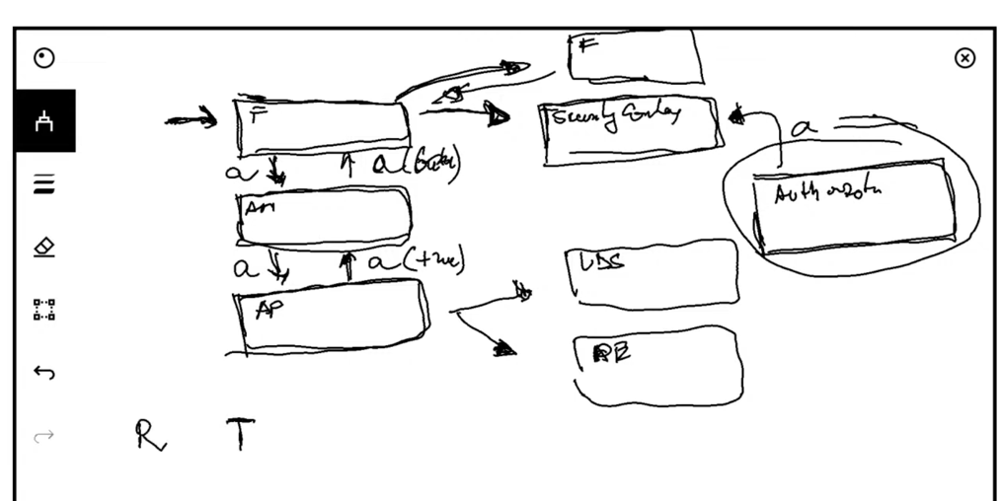

**Security context is per thread, per request**

```
Every request made in our application runs on its own thread, managed by JVM Called ThreadLocal.

Every request will only see the data that is associated to it.

Security context is different from a session.

```


**Eager Fetching vs Lazy Fetching**

```
1. EAGER Fetching

With FetchType.EAGER, related data is loaded immediately together with the parent entity.

@ManyToOne(fetch = FetchType.EAGER)
private Customer customer;

When you fetch an Order, the Customer is also fetched automatically.

2.Lazy Fetch

With FetchType.LAZY, related data is loaded only when accessed.

@OneToMany(fetch = FetchType.LAZY)
private List<OrderItem> items;

```
**Notes By**

```
Mbugua Caleb

```