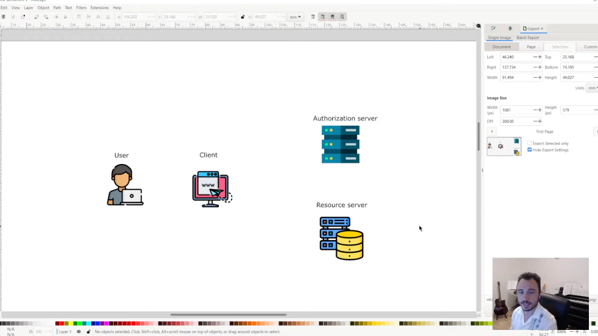
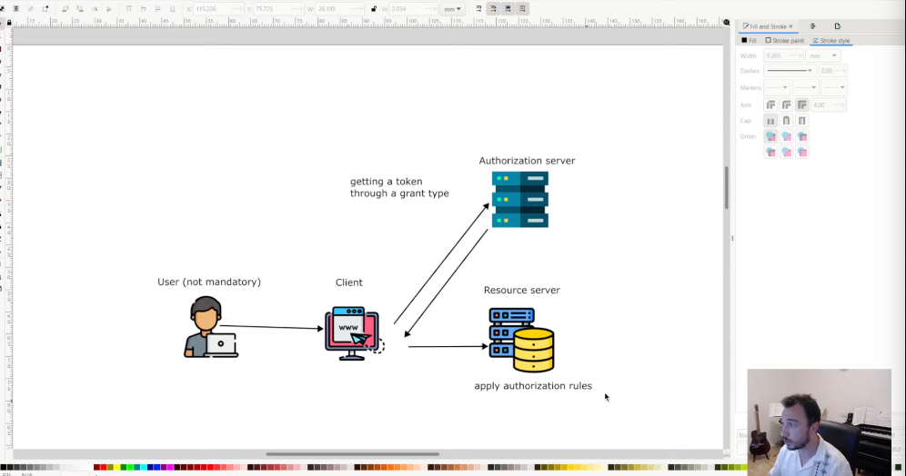
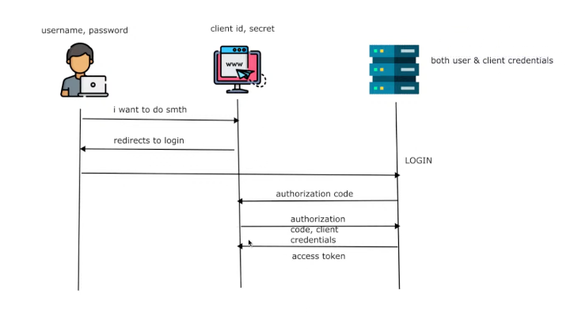
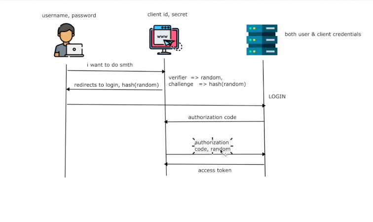
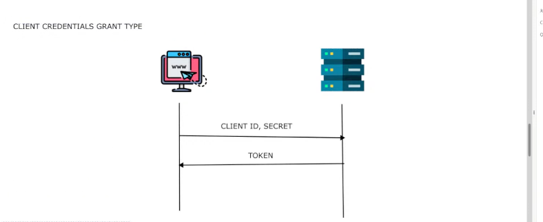
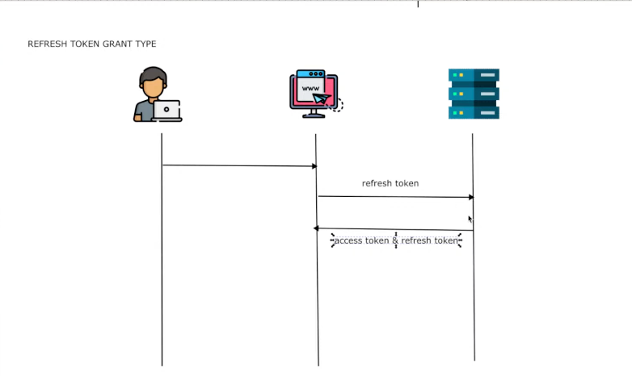

**Spring Security Intro**

```
It is about application level security

(a)Authentication

(b)Authorization

security is large. it can start from the network to the infastructure layer.

It is the logic we write in our application that is related to security.

Authentication-->Logic in my application that decides who is the user trying 
to do something.

Can be achieved By: [ UserName & Password, Hashed Fingerprint, or Some Complex 
Certificate]

Authentication is where the application tries to establish who you are.
Authorization...the application decides if you are allowed or not allowed to do something.

we configure the authorization rules.
In a web application i protect access to  my resources based on the
authorization rules.

We have specific authorities or roles.
Authority---? is something you have. An action i can do.
Role--------? is something you are.It is a Badge. Admin, Manager, Etc

They have the same interface behinds the scenes, (Both Authentication and Authorization)
GrantedAuthority.

Spring security provides varoius authentcation mechanisims

(a)Http Basic
(b)Cert
(c)Jwt/Oauth2 flows

```

| Authentication | Authorization Rules      |
|----------------|--------------------------|
| Http Basic     | WEB Apps  (Http Filters) | 
| Certificate    | Non Web Apps (Aspects)   | 
| JWT/Oauth2.0   |                          | 


**Spring Security Config**

```
By default all resources in my application when i have spring security are secured.
With the randomly generated credentials.

They are secured by Http Basic Authentication.

```

**Encoding, Encryption and Hash Functions**

| Encoding                                                                                 | Encryption                                                                              | Hash functions                                                                                                                             |
|------------------------------------------------------------------------------------------|-----------------------------------------------------------------------------------------|--------------------------------------------------------------------------------------------------------------------------------------------|
| It is function that is always pssible to <br/>revert somehow.                            | You are transforming an input into an output<br/>                                       | From and input you can get the output.<br> but from the output you cannever by any means find the input.                                   |
| it may be a mathematical computation that does not <br/> need even a secret to decode it | But to go back to the input you always need a secret.                                   | 2nd rule of a hash function is <br/> if you have an input for a hash function you can be able to test if it corresponds to the output<br/> |
| example 345 --> reversing it to 541 is an encoding<br/>                                  | Not everyone is able to find waht was the input after an<br/> encryption functioin<br/> | wow, this is how padsswords work, I.e you can do an equality check, but you can never revert back.                                         |
| In an encoding, you can always revert the output to find the input if you know the rule  | It is still a trandfomation but it implies you need a secret to go back to the input.   | if one stoled hashed password, they cannever find the input.                                                                               |
| In an Ecoding you do not even need to have a secret.                                     | Without a secret you cannot go back.                                                    |                                                                                                                                            |
| Can be always reversed                                                                   | A secret is also known as a key and it can be symetric or assymeric,                    |                                                                                                                                            |

```
Symmetric encryption uses a single shared key for both encrypting and decrypting data, making it fast and highly efficient for bulk data. 
Asymmetric encryption uses a key pair—a public key to encrypt and a private key to decrypt—which solves the key-distribution problem but is much slower

```


**Creating UserDetails Service**

```
it is that compoment that manages my details.
it tells spring security where to get credentials from.
Meaning i can have my custom HttpBasic password.
if i have users, i can store their passwords.

```

**Spring Security Architecture (Behind the SCENES)**
**The Authentication Filter**


```
Spring Security especially in WebApps is a sequence of filters.
Http Request get through to the application after a number of filters.
When a HTTP request comes, before it goes to the controller, we start with the  {Authentication Filter} first of all

(a)Authentication Filter---> Authentication Manager
(b) Authentication Manager------->Authentication Provider
(c)Authentication Provider-------> UserDetails Service
(d)User details service, if password is hashed calls---> Password Encoder
(e)Once the Match is successful, we put the UserDetails in the security context.
   (With the Role and Permission..
(f)After this we can go to the authorization Filter.

Contract between Spring security and your application  bu which your app knows how
to obtain user details.

UserDetails is an interface, all we need is to implement it and spring secuerity
will know where to get user credentials...

including the DataBase or even a web service

(g)After a successful authentication, the User Object is stored in the context.
  Authentication is stored in the security context.
  
 public String demo(){
        var u = SecurityContextHolder.getContext().getAuthentication();
        u.getAuthorities().forEach(System.out::println);
        return "Demo";
 }
 
```

**Adding User Details to context**

```
Method One (Configuration Way.........
@Configuration
public class SecurityConfig {

    @Bean
    public UserDetailsService userDetailsService(){
        return new JPAUserDetailsService();
    }
}

Method Two (StereoType Way............

@AllArgsConstructor
@Service
public class JPAUserDetailsService implements UserDetailsService {
    private final UserRepository userRepository;

    //Spring security will get my User from this method
    //And return a userDetails Object and place it into the context.
    //from the below implementation i have provided my User to Spring Security.
    @Override
    public UserDetails loadUserByUsername(String username){
        var user = userRepository.findUserByUserName(username);
        return user.map(SecurityUser::new).orElseThrow(()->new UsernameNotFoundException("username not found" + username));
    }

}

N/B
My Default Implementation of Authentication in Spring Security is HttpBasic.
UserName & Password

```

**(Granted Authority Interface) -->Implementation Roles and Authrorities**


```
@AllArgsConstructor
public class SecurityUser implements UserDetails {

    private final User user;

    @Override
    public String getUsername() {
        return user.getUsername();
    }

    @Override
    public @Nullable String getPassword() {
        return user.getPassword();
    }

    @Override
    public Collection<? extends GrantedAuthority> getAuthorities() {

        return List.of(() -> "read");
    }

}

A spring security User has what we call granted authority, which is the interface beneath
which roles and authorities are implemented.

An authority is an action which a user can do. (read, write, delete)
A role is a Badge represented by a subject, admin, manager,client,visitor
It depends on how you want to implement  authorities in your app.
If you want granular actions, Authortities
I may also want to badge my users, eg Admin, and all the actions they can do.
(Role-->Groups Actions)

```

**Project three**


**Task (Implementing our own custom Authentication**

```
The above is a custom authentication architecuture that uses my custom key to authenticate.

.ie.Not UserName and Password.

Rather than the username and password, we can also be able to implement our custom authentication.
(Convention ones include: Http Basic, OpenId connect, OAUTH2.O, cerificate authentication syle.

```

**SecurityFilterChain Bean**

```


When writing my custom spring security configuration, i must overrie this bean

  @Bean
    public SecurityFilterChain securityFilterChain(HttpSecurity http){
       return http
               .addFilterAt(customAuthenticationFilter, UsernamePasswordAuthenticationFilter.class)
               .authorizeHttpRequests((authorize) -> authorize.anyRequest().authenticated())
               .build();

    }
    
//if i override the securuty filter chain Bean, then i mist write my default security configuration
    //One this is realise tis the filter that spring boot configures for us by default.(UsernamePasswordAuthenticationFilter)
    //if i want to configure my authentication i use the security filter chain bean.
    //By default the Security filter chain uses the UserName and Password authentication filter.
    //I am overriding the default implementation of the security filter chain
    //i am adding a new filter at the position where the UserNamePasswordFilter would have stayed
    //i am adding a custom authentication filter at the position of the other filter.
```

**Authorization Filter**

```
Takes in the authentication from the security context and applies the rules.

```

**Project Four (Multiple Authentication)**

```
(Old spring security design where you could have had Just one authentication manager,
and multiple providers)

(this can still work but only with two default filters)


When implementing multiple authentication, i need two different authentication filters.

```

**Custom Filter + Default Filter Architecture**


**Http Security Object**

```
HttpSecurity Object is the one that defines the entire security configs
for Our Application.    
When our applications are starting, they normally use this configuration

The below creates an entire Http Basic configuration.
(a)When HttpBasic is called, it creates a configurer.
(b)When the application starts, it creates the Filter, Auth manager, provider, etc..
(c)Anything we add here helps configure something in the entire architecture of Spring Security.
   

When i have multiple authentications and therefore multiple filters, what spring security needs me to do
is to return an authentication,

Either of my Filters should return an Authentication Object.


```

**Lesson 5**


**Authorization**

```
Key Concept----->Every Form of Authentication has a filter.

Inside the AuthX Filter,(we have the manager, provider, user details service etc

At the end if the authentication is successful, we normally have an Authentication Object
stored in the security context.(it is a standard security Object)

The authentication object has got everything about the user who authenticated,
i.e Roles & Permissions as well.

The Authorization filter now uses this information to give or deny  access to our 
application resources.

Authorization is always after authentication because it depends 
on the Authentication Object.

Authorization can be implemented in 2 different ways in spring security.

(a)Endpoint Level.

(Only for WebApps) 
(Applied in Filter Chain before the controller)

(b)Method Level.

You can apply it on any bean method.
The method is aspected via spring security rules.

401-->Authentication fails
403-->Forbidden, Authorization fails.

   //endpoint level authorization
        /*used for web applications
         (a).anyRequest().authenticated(), for this one all the resources will be accessed as long as the user is authenticated.
            matcher method + authorization rule
            
           
          //1.Which matcher method i should use and how? (anyRequest(), mvcMatchers(),antMatchers(), regexMatchers()
            2.How to apply different authorization rules.

          The only way you will get rejected is if you did not authenticate at all.

         (b)authorize.anyRequest().permitAll() // rule 2 (permits all, but when you decide to add a password that is wrong, it will not authenticate
           when you try to use a wrong password, the authentication filter will fail, wow.
           wrong auth will still reject,
           authorization is always after authorization

          (c)authorize.anyRequest().hasAuthority("read")
            Only when you have the authority read, you can access any endpoint.

          (d)  authorize.anyRequest().hasAnyAuthority("read","write") enumerates authorities

        Roles relate to a group of actions or permissions

          (e) configurations with the Spring Expression Language.
           authorize.anyRequest().access(new WebExpressionAuthorizationManager("isAuthenticated() and hasAuthority('read')") ))//SPEL----->authorization rules )

```

**Tips**

```
1.SpringBoot---->Convention over configuration apporoach
Spring Boot based on dependencies we add configures our applications somehow.

spring-web (will confugure a tomcat container, dispatcherservelet, view)
security

2.Spring Security, (Spring Boots)

3.Spring Security Starts with a Filter Just before your request.

when using a web app

security filter---->endpoint

4.Wow spring boot provides a default username and password authentication filter,that
we configure with a UserDetail service.

```

**Thread Local Concept**


**Security context is per thread, per request**

```
Every request made in our application runs on its own thread, managed by JVM Called ThreadLocal.

Every request will only see the data that is associated to it.

Security context is different from a session.

```

*Lesson seven**

```
We can apply authorization rules, at method level of any bean.

**Method Based Authorization**

```

Applicable for any type of application. WEB and Non Web Based.

Two ways of Applying Authorization Roles:

1.Filter Level 2.Method Level

```

**Design**

```

Authentication Filter Security context (Has a User with Authoritles and Roles AUHTORIZATION Filter. Controller.
Service--->Repository Access to the controller is based on passing the authorization rules

One way to apply security is on the filter chain.

The other way is on Method Level of any Bean as long as it is managed by Spring.

The authorization rules on method level will still continue using the secuerity context

so an authentication filter still becomes necessary Authentication is an important first step to authorization

```

**Annotations**

```

To have method security work,since it is an aspect we need to have GlobalMethodSecurity as Enabled @Configuration
@EnableMethodSecurity (prePostEnabled =true)
//@PreAuthorize, @PostAuthorize, @PreFilter @PostFilter

prePostEnabled =true, enables the four annotations.

Once i enable the aspects in the configuration, i can use the annotations on top of my methods.

@GetMapping ("/demo1")
@PreAuthorize ("hasAuthority ('read')")
public String demo () { return "Demo"; }

@GetMapping ("/demo3")
@PreAuthorize ("hasAnyAuthority ('write', 'read')")
public String demo3 () { return "Demo"; }

Wow, endpoint authorozation has abig advantage of being cleaner when you have many endpoints

```


**What happens if we have both Authorizations**

```

Remember that the filter chain is always before the controller. The Filter will always apply first.

The request always goes to the filter first, then the controller method.

```
**Wow, Something Unique**

```

//todo (Notes)
//Using preAuthorize we are able to gain access of our PathVariables //authentication object from security context.
//after auth is successful an authentication object is stored in the security context. //this means we can apply
different authorization rules based on the data in the request @GetMapping ("/demo3/{smth}")
@PreAuthorize ("#something == authentication")
public String demo3 (@PathVariable ("smth") String something) { var a = SecurityContextHolder.getContext ()
.getAuthentication ();

        return "Demo";
    }

```
  ```
*
    * (a)PreAuthorize--->the annotation we use hundred percent of time. Before resource access
    *
    * (b)PostAuthorize is called so because the rules will be applied after the Method is called
    *    //Mainly used when we want to restrict the access to some returned value
    *
    *  //restricts the access to the return value if the condition is not executed correctly
    *     //Mainly used when we want to restrict the access to some returned value
    *     //Demo 5 will only be retuned if return is not Demo 5
    *
    *
    * (c)PreFilter
    *     //Whenever we use preFilter, we must have as a Parameter an Array
    *      if we have more than one filter in the List, we use the Filter Target to Specify
    *      the List which PreFilter should act on
    *
    *      It filters Based on a condition the values that are sent to the Method
    *
    * (d)PostFilter
    * //@PostFilter
    *     //the Post Filter will filter the return value based on the auhtorization condition
    *    //the return type must be either a collection or an array.
    *
    *    the returned collection must be mutable,
    *
    *            return List.of("abcd", "wert", "qajkhk", "rhsbs"); (Wont Work)
    *            new ArrayList<String> () -->Works
*/


**OAUTH2.0 Notes**


**Sample Authorization Server LogIn Page**


```
Summary-->Get Token, use token for the resource servers)

wow, it is always good to know things step by step not to have holes in learning
(My Principle)

(a) User and Client

(b)Authorization Server

{Handles the authentication for the mulitiple backends or resource servers}

(c)Resource Server.

{These are the backends or the resources in the OAUTH2.0 Architecture.

N/B
wow, you can have the Authorization and the resource server in one application.
However it is good if they are apart.


I do not want my users artificially managed, i take them in a different authorization server.
  (i am cenralizing all my Users)
  (i take them into the Authorization Server)
  
User Must not exist, GrantType is different

A client calls the auhthorization server to make sure it is authenitcated, through a grant type
Once the client gets token, the token acts as an access card.It will allow the client to open resources in the
resource server.

Token will have the priviledges according to the authentucated user.
.ie they must not access all the resources based on their priviledge

The resource server will identify who is makeing the request, in terms of the Role.
then apply the authorization rules.

Authorization server makes the authenitication, then provides enough details
thought the token, so that the Resource Server can apply the authoruzaton rules.


```



```

Token will have the priviledges according to the authentucated user.
.ie they must not access all the resources based on their priviledge

The resource server will identify who is makeing the request, in terms of the Role.
then apply the authorization rules.

Authorization server makes the authenitication, then provides enough details
thought the token, so that the Resource Server can apply the authoruzaton rules.

```

**Three Steps of OATH2.0**

```
1.How does the client  get a token from the Authorization Server?

There are several ways in which a token can be obtained
These several ways are called grant types

Important Grant Types

1.authorization_code -->Used when yiu have a user (PCKE)
2.Client credentials (WHEN You dont have a User)
3.Refresh token --> if you do not want the user re-authenticated if the access
  token is not valid anymore.

Depracated GrantTypes (Do not Use)
Implicit, password grant type

2.How does my resource server know that the token is valid and 
appply the authorzation rules?

```

*(a)Authorization code grant type*


```
The first thing the client does, is redirecting the User to a login page in the
authorization server. eg, SAFARICOM_DI, GOOGLE, MICROSOFT

The User will put their credentials in the login page of the authorization server

The login is not something designed by the client but something in the authorization 
server side.

If it was deisgnened by the client we would have been on the authoirzation grant type
that is depracated and not in use any more.

The User Logs in the Authorization Server

Once the User Logs in successfully, the authorization server redirects them back to a page
in the client.

How does the authorization server know to what page they redirect the user?

(a)The Authorization server must have the URL Regaistred
(b)the client also sends that URL as it directs the user to the log in page of the authorization server
  (that URI is called the redirect URI, it is provided by the client and needs to be known previously
   by the authorization Server)
   
  as it re-directs we have a key called the authorization code
  it is a kind of a code or a secret that the authorization server shares with the client
  
  Hence the name of the grant type as authorization code
  This is the first thing a client gets after successful authenitcation of the user.
  
 (c) With the authentication_code and after identifying itself via the client credentials, 
 it makes a post request  to the authrzation server and get the token back.
 
 (Two things (code + client_creds = token back)
 
 The client credentials are not the user crdentials. Theyare the client_id, client_secret
 They identify the applicaation and are not [username and password = auth code]
 Wow, the Authorization server manages both the user and client credentials.
 
```

**Integrating PCKE to the Authcode grant type**



**What is PCKE?**

```
he client credentials are not that safe, remember the client is public
The client needs to store them somewhhere, yet its public.
for non public clients, we can use auhtoirization_code without PCKE
recommedned is we should use PCKE
Using PCKE We use something else to identify the client instead of the client crednetials

How is PCKE Achieved?
When the redirect to the login page happens, getting the auth_code.
The client generates two pieces of info: challenge and veirifier

challenge===>random
verifier=====>hash(random)

The hash is applied to this call.
Remember a hash function has no reverse.But can be verified ny mathces

instead of the client sending it crdentials it will sesnd the
random value, which only itself knows, and was hashed in the first handshake and sent to the authorization server

(Two handshakes)
When a user logs in, they are redirected to the log in page of the authorization server,
with a hash of the random value (to be used in place of client creds)

when they get an auth code, the send it with the random value, and the authotrization server
through pattern mathcing will validate

```

**Client Credentials Grant Type (When we do not have a User)**



```
It is just a simple two step process, (Client ID + Client Secret)--->TOKEN

It is called so when we have a service,that needs to authenticate but No User

How can we implement a case when we dont have a user?

we Use Client credentials.

We need to be caefull not to allow all the endpoints when using the client credentials.
Very specific endpoints should be accessed via client credentials grant type.

```

**Refresh Token**


```
A refesh token is a value we get in the response, after a user authenticates.

Allows us regenerate a token, without a user having to authenticate,
within the same session

Without a referesh token, the user will have to authenticate again
we can minimise the token lifespan,and refresh it as long as the user is active

The refresh token is sent to the authorization server, and clients the client
a new access and new refesh token...

```

**Token Validation By the Resource Server**

```

Tokens.(Understanding Tokens)

JWT are not the only tokens that exist out there.

(a)opaque-->Tokens that dont contain any data.

(b)non-opaque-->Tokens that contain information inside, example JWT.

(Key About Tokens)
A token can be anything....
The token should help the resource server apply the authrozation rules.

For Opaque Tokens, the authorization server will always implment an introspection endpoint

The introspection endpoint is an endpoint that gets a token then returns 
information/details about the token.

The intorospection endpoint is used by the  resource server, to be able to 
get info on authorization rules.

The resource server will always introspect the token and get the needed values.

NON OPAQUE TOKEN (Example JWT)
contains info inside
resource server does not call the auth server

The token is signed.
the resource server is configured with a key that can validate 
the  signture, and get the info from the token, thus no need for intro spection
it gets all the info from the token itself

```
**Eager Fetching vs Lazy Fetching**

```

1. EAGER Fetching

With FetchType.EAGER, related data is loaded immediately together with the parent entity.

@ManyToOne (fetch = FetchType.EAGER)
private Customer customer;

When you fetch an Order, the Customer is also fetched automatically.

2.Lazy Fetch

With FetchType.LAZY, related data is loaded only when accessed.

@OneToMany (fetch = FetchType.LAZY)
private List<OrderItem> items;

```
**Notes By**

```

Mbugua Caleb

```