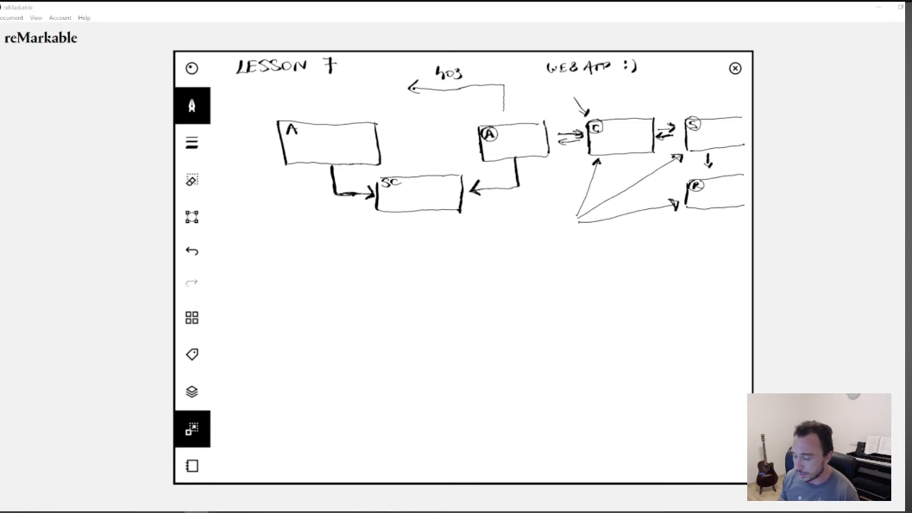

**Method Based Authorization**

```
Applicable for any type of application.
WEB and Non Web Based.

Two ways of Applying Authorization Roles:

1.Filter Level
2.Method Level

```

**Design**

```
Authentication Filter
Security context (Has a User with Authoritles and Roles
AUHTORIZATION Filter.
Controller. Service--->Repository
Access to the controller is based on passing the authorization rules

One way to apply security is on the filter chain.

The other way is on Method Level of any Bean as long as it 
is managed by Spring.
 
 The authorization rules on method level will still continue using
 the secuerity context
 
so an authentication filter still becomes necessary 
Authentication is an important first step to authorization

 
```

**Annotations**

```
To have method security work,since it is an aspect we need to have GlobalMethodSecurity as Enabled
@Configuration
@EnableMethodSecurity(prePostEnabled =true)
//@PreAuthorize, @PostAuthorize, @PreFilter @PostFilter

prePostEnabled =true, enables the four annotations.


Once i enable the aspects in the configuration, i can use the annotations on top of my methods.

@GetMapping("/demo1")
    @PreAuthorize("hasAuthority('read')")
    public String demo() {
        return "Demo";
    }
    
@GetMapping("/demo3")
@PreAuthorize("hasAnyAuthority('write', 'read')")
public String demo3() {
    return "Demo";
}

Wow, endpoint authorozation has abig advantage of being cleaner when you have many endpoints

    
```



**What happens if we have both Authorizations**

```
Remember that the filter chain is always before the controller.
The Filter will always apply first.

The request always goes to the filter first, then the controller method.

```
